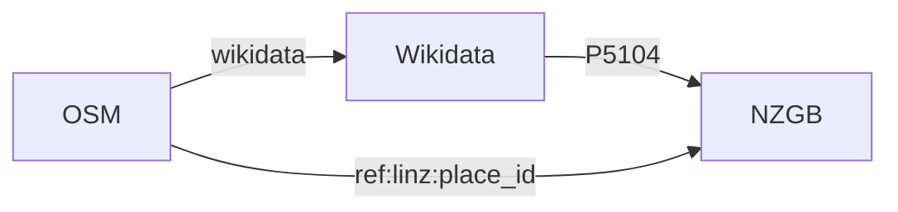

# NZGB ➡️ OSM place name conflation

This repository contains the code that regularly compares place names in [OpenStreetMap](https://openstreetmap.org) with the [New Zealand Geographic Board (Ngā Pou Taunaha o Aotearoa) Gazetteer](https://gazetteer.linz.govt.nz).

How this works:

- Once a week, the following process is automatically run:
- The list of place names is downloaded from the [NZGB](https://gazetteer.linz.govt.nz/gaz.csv)
- An extract of the OpenStreetMap planet is downloaded (containing only Oceania & Antarctica)
- All wikidata features that are linked to the NZGB are downloaded
- The OpenStreetMap planet is compared with the gazetteer, and any discrepancies are identified and categorized
- The result of the conflation process is converted into a format that allows OpenStreetMap mappers to review each place using the same tools as the [LINZ-to-OSM address import](https://github.com/osm-nz/linz-address-import).

# Usage

If you want to help by adding missing place names, visit [✨the dashboard✨](https://osm-nz.github.io/place-name-conflation).

# Setup

If you want to contribute to the code, the following needs to be done manually:

1. Clone this repository
2. Download [nodejs v20.11](https://nodejs.org) or later
3. Run `corepack enable`
4. Run `yarn`
5. Run `yarn start`
6. Use the generated [`osmPatch`](https://github.com/osm-nz/linz-address-import/blob/main/SPEC.md) files to update the place names in OSM
7. Or run the website locally by running `cd client && yarn start`

# The original import

This codebase originally included a lot of complicated logic, which was used to speed up the one-off effort of importing 30,000 place names.
Now that the initial import is complete, this logic has been removed to simplify and speed up the process, so that it can run automatically every week.

Some of the removed logic includes:

- Automatically detecting matching features with no [`ref:linz:place_id`](https://osm.wiki/Key:ref:linz:place_id) tag
- Logic to guess whether a name is English or te reo Māori ([moved to a separate repository](https://github.com/k-yle/name-mi))
- A system for extracting [`name:etymology`](https://osm.wiki/Key:name:etymology) from the feature's description
- A system for importing the geometry of lines/areas that were missing using [the L](https://data.linz.govt.nz/layer/52423)[DS](https://data.linz.govt.nz/layer/52424)

See the [`legacy` tag](https://github.com/osm-nz/place-name-conflation/tree/legacy) for the final version of the codebase which included these features.
