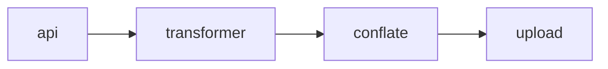

The `core` folder is for everything that isn't part of the main process.

The process in grouped into stages by folder, based on this diagram:

```mermaid
flowchart LR
  api --> transformer --> conflate --> upload
```
